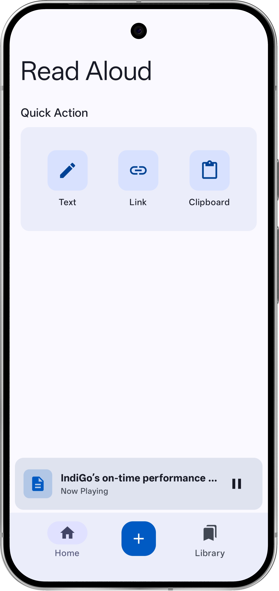
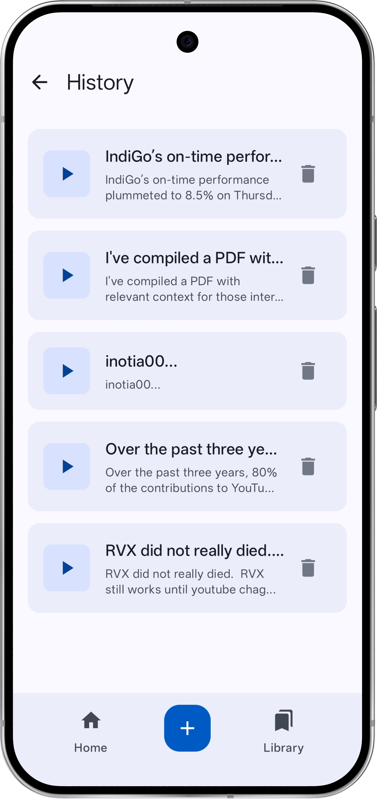
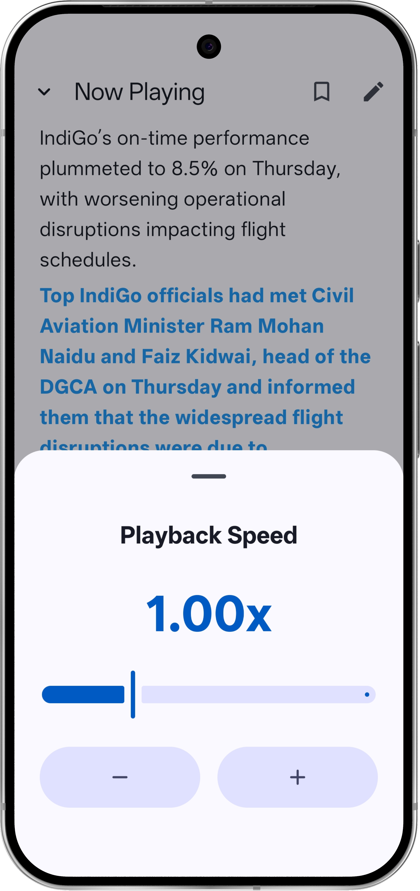
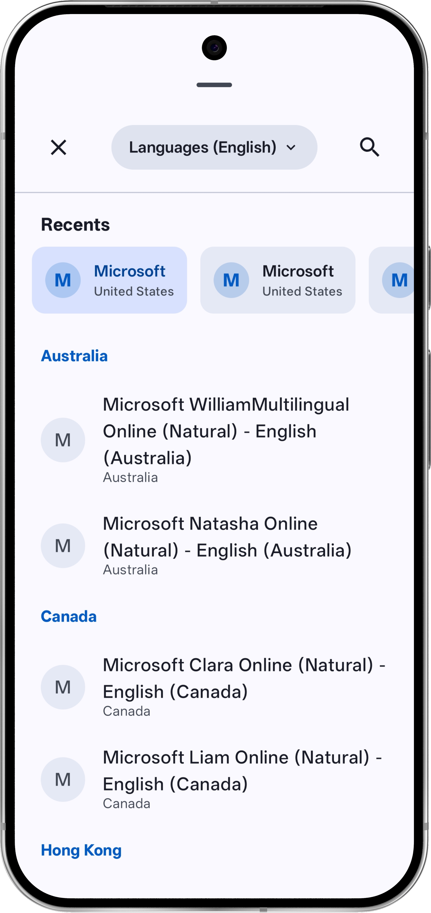
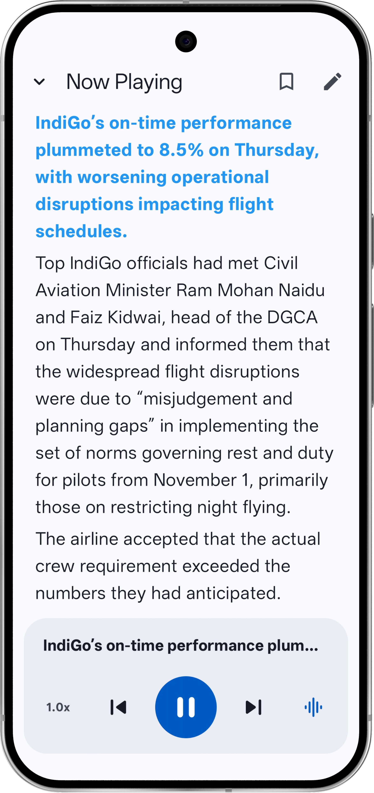

# Read Aloud

Hi! This is a simple Android app that helps you listen to text instead of reading it. It's perfect for when you want to rest your eyes or if you just prefer hearing things out loud.

I built this app using **AI and Vibe Coding**. This means I used AI tools to help write the code and focused on making it work exactly how I wanted it to feel, rather than doing everything the traditional way.

### Preview

  
  
  

  
  

### What it does

- **Read from any app**: Highlight any text, tap the "More" button (three dots), and pick **Read Aloud**. It starts reading instantly without leaving your current app.
- **Listen to website links**: Share any link from your browser to this app, and it will grab the text and read it for you.
- **Quick Actions**: On the home screen, you can quickly paste text from your **clipboard**, type something in manually, or just drop a link.
- **Your Library**: The app keeps a **history** of everything you've listened to, so you can go back and listen again whenever you want.
- **Natural Voices**: You can choose from a long list of natural-sounding voices from different countries (like Australia, Canada, UK, etc.).
- **Control the speed**: Want it to read faster or slower? You can easily adjust the **playback speed** to fit your vibe.
- **Bookmarks**: Save important parts of a text so you can find them easily later.

### How it's made

The app uses **Kotlin** for the main structure and **Python** for the voice part. I used a tool called Chaquopy to let them work together, which helps the voice sound better and more natural.

### How to use it

#### Option 1: Install the APK (Easiest)
1. Go to the [Releases](https://github.com/SamuelAdmand/Read-Aloud-App/releases/latest) page.
2. Download the APK that matches your phone's architecture (usually `arm64-v8a` for modern phones, or `universal`).
3. Open the file on your phone and install it.

#### Option 2: Run from source
1. Download the code to your computer.
2. Open it using Android Studio.
3. Make sure the Python plugin is ready to go.
4. Run it on your phone!

### License

This is a personal project to show how cool it is to build apps when you partner up with AI.
